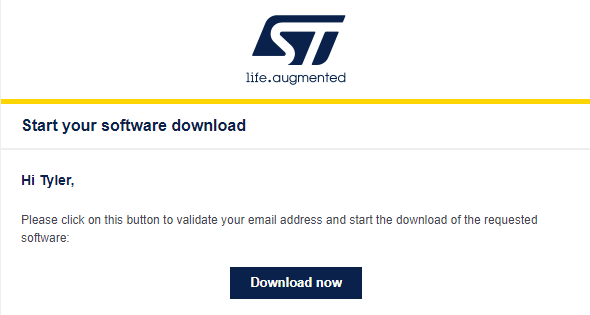
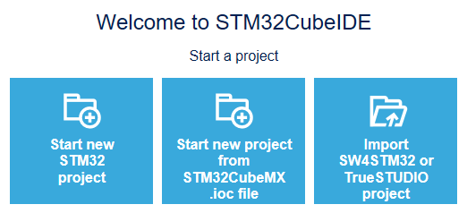
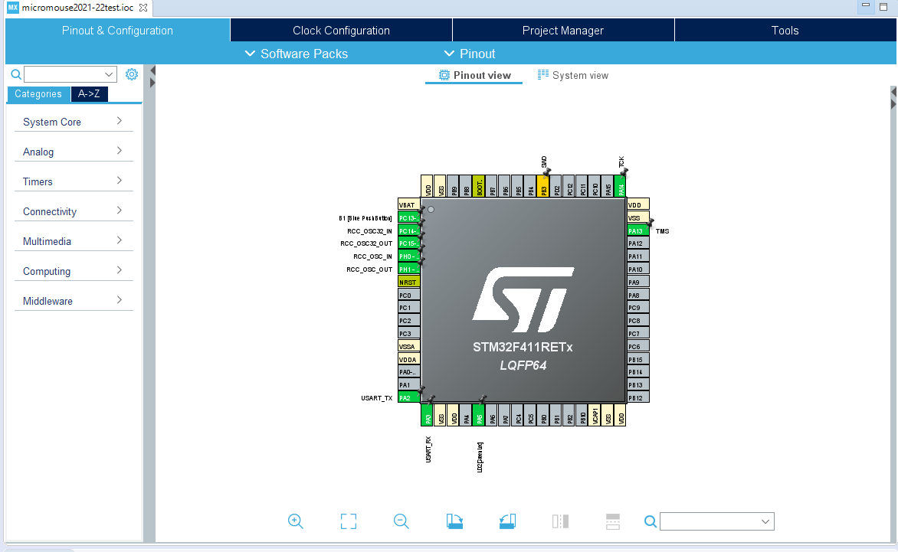
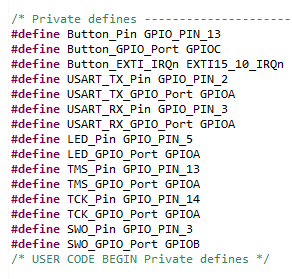
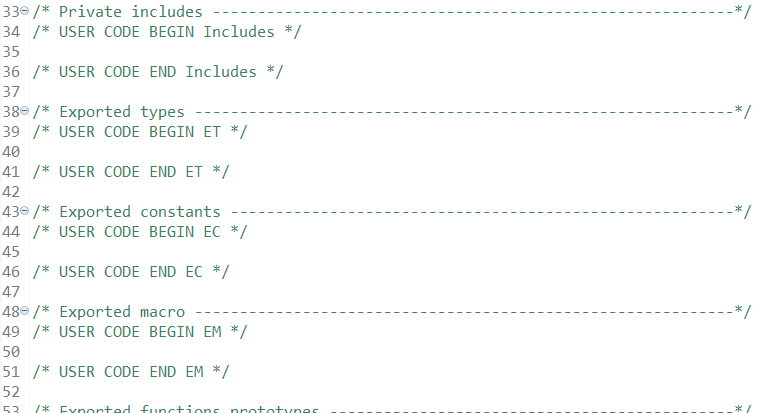
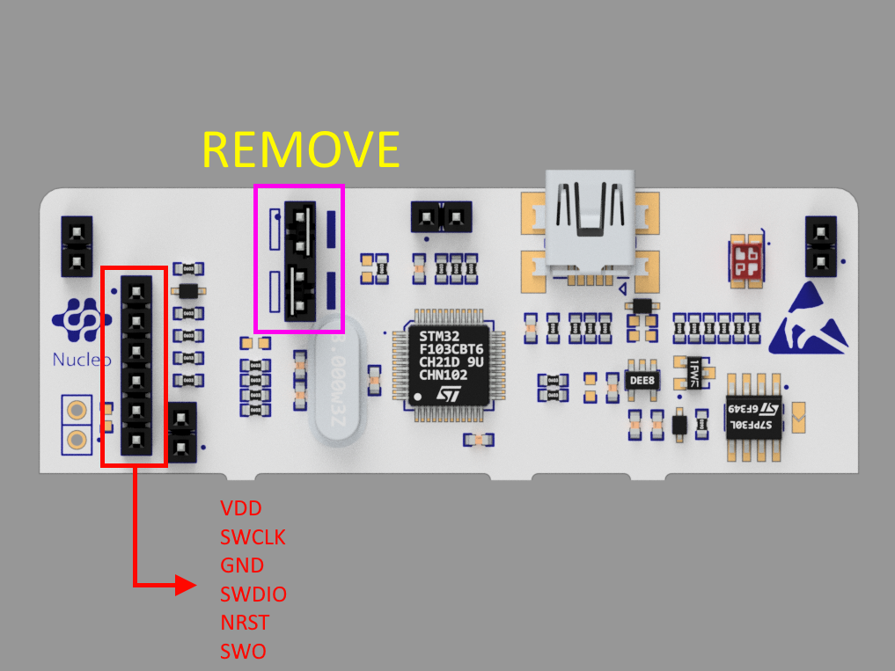
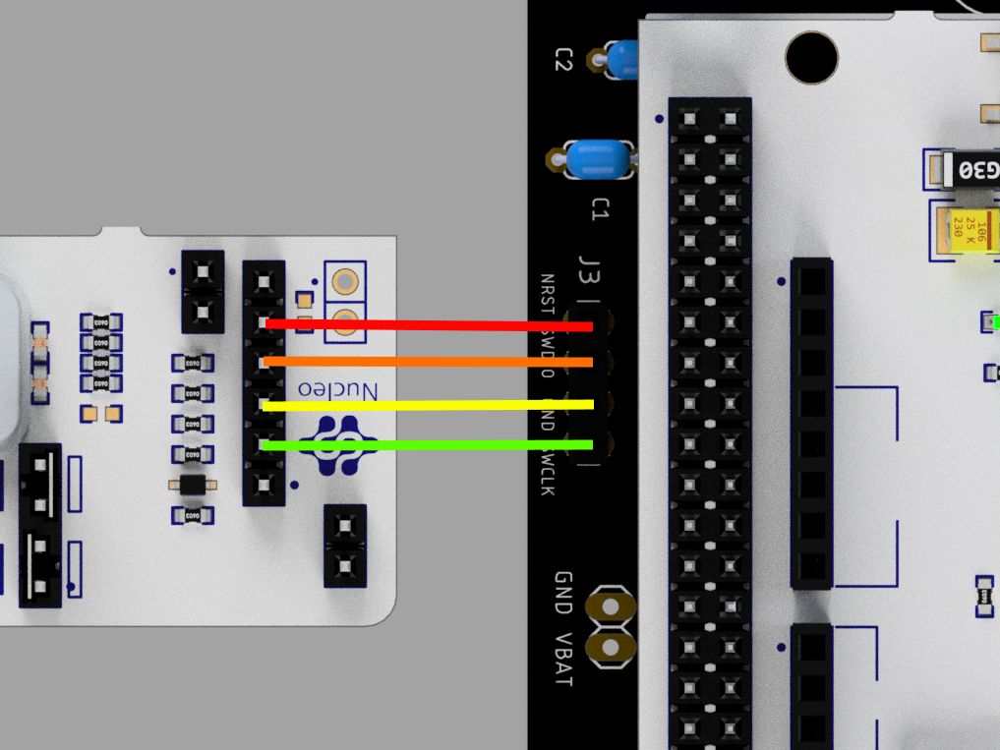

# Module 5
### STM32CubeIDE Module

## Overview

1. [Installing CubeIDE](#installing-cubeide)
2. [Coding in CubeIDE](#coding-in-cubeide)

In this module you will learn about the software that we use to program the STM32 microcontrollers! We will walk you through setting up the IDE, and some basic code to get you familiar with the software. At this point, you should have finished your schematic, PCB, and have started the soldering components onto your mouse!

## Installing CubeIDE

The STM microcontrollers can be programmed and configured using the STM32CubeIDE. In this section, we will walk you through setting up the software for your mice so that you can get it up and running!

### Step 1: Download Installer

* Visit [this website](https://www.st.com/en/development-tools/stm32cubeide.html) and click the “Get Software” button. Then click the “Get Software” button next to your operating system.  

* Accept the license agreement. You will then be prompted to either login/register with a my.st.com account or just validate your email once. Either option is fine; it is fastest to just enter your name and email address and validate it in the email they send you if you do not already have an account.
* If you enter your email address, the download link will be in the email sent to you. Except it will say your name instead of “Tyler” :D

* Extract and run the installer. It’s normal for the installation to take a while!

### Step 2: Setup CubeIDE

* Launch CubeIDE. Default directory is fine, just press “Launch” when prompted.
* Click “Start new STM32 project”

    

* You will now have to select the correct MCU for the project. On the tabs at the top, click “Board Selector”, then in the search bar type “Nucleo-F411RE” (or whichever board you’re using). Only one device should show up. Click on that one and select “Next”.

    

* In the following prompt, give your project an appropriate name and select “Finish”

    

* A dialogue box will ask if you want to open the STM32CubeMx perspective. Press yes. CubeIDE will then download the necessary software packages.
* That’s it for the setup! 

## Coding in CubeIDE

So far, you installed CubeIDE and set up a project for the microcontroller used on the STM32F411RE board. This final part of the assignment will walk you through writing your first program in CubeIDE. Your program, when finished, will light up an LED on the Nucleo when a button is pressed. Both the LED and button are built into the Nucleo, so there is no hardware assembly required for this part of the assignment.

Typically the workflow for a project in CubeIDE are as follows:

1. Configure the pins on the microcontroller to do what you want. This may mean setting a pin to behave as an input or output, configuring a pin to interface with a timer or interrupt in the microcontroller, and so on.
2. Once configured, CubeIDE will generate some low level driver code and define some constants for you that you can use in your actual written code to refer to the pins you configured.
3. Write the code!
4. Upload your code to the MCU.

NOTE: Before getting started, you should at least the full power delivery schematic soldered onto your board. This includes the voltage regulator, its decoupling capacitors, the jst connectors for the batteries, and the power switch. Furthermore, you must have the 2 2x19 pin headers soldered on to be able to connect the nucleo to your mouse. Finally, you should have the 4 pin programming header soldered on to be able to interface with the mcu.

CubeIDE may look big and complicated initially, but this assignment will walk you through all the basics you need to know. Let’s get started!

## Step 1: Configure Microcontroller Pins

* When you first open your project in CubeIDE, you should see a screen like this: 

* This is called the “Device Configuration Tool.” If you don’t see it, expand your project director in the left sidebar and open up a file ending in .ioc.
* This basically shows a physical representation of your microcontroller. The boxes around it are the pins, corresponding to the actual pins on the microcontroller which can be configured to interact with the rest of your circuit.
* The tan colored pins in the Device Configuration Tool correspond to power and ground pins, and cannot be configured in software. The yellow-greenish colored pins are reserved for reset and boot functions, so you also cannot do much with them in software. The green pins are those that are peripherals already located on our Nucleo. Everything else that is grayed out can be configured! Certain pins have access to certain features, which are delineated in the MCU’s (quite long) [datasheet](https://www.st.com/resource/en/datasheet/stm32f411ce.pdf). Don’t worry about this for now, you’ll learn as we go along.
*  Now let’s set up the pins for our button and LED!
    * Lucky for us, these pins are already set up, since they’re built into the Nucleo. However, for the sake of practice, go ahead and verify that pin PC13-ANTI_TAMP is set to GPIO-EXTI13, and that pin PA5 is set to GPIO_OUTPUT.

* **NOTE:** This assignment shows how to set up the button with an external interrupt. An interrupt is a signal that causes the main program you are running to be halted briefly to execute some side bit of code. Hence the _EXTI13 instead of _Input option. There are easier ways to implement an input button, but since external interrupts are used a lot in Micromouse, we’ll show you how to use them here.

Before we actually begin writing code, there are a few more things we need to set.

* In the sidebar to the left, expand “System Core” and click “GPIO.” Make sure the “GPIO” tab is selected in the menu that pops out.
* You should see the two pins from earlier here.

        

* Let’s start by giving them more useful names. Click on the PC13-ANTI-TAMP and in the menu that pops up at the bottom change the “User Label” field to “Button.”
* Change PA5’s user label to “LED.”
    * **NOTE:** You can usually name these whatever you want, but since the provided code later in this assignment assumes these are the pin names, it’s best you use these labels for this assignment.
* Click on PC13-ANTI-TAMP again and change the “GPIO mode” field to “**External Interrupt Mode with Rising/Falling edge trigger detection.”**
    * This means that whenever the MCU detects that the button is being pushed down OR depressed, aka whenever there is a sharp rise or edge in the voltage OR a sharp decreasing edge in the voltage sensed by the pin, it will update the button. By default this is set to “External Interrupt Mode with Rising edge trigger detection,” which would toggle the button every time you press it instead of turning on when pressed and turning off when released. Try it out if you are curious to see it!
* Navigate to the NVIC tab and make sure EXTI interrupts are enabled.

### Step 2: Generate Driver Code

We have finished pin configuration, so let’s generate our pin configuration code!

* Near the top of your window, there’s a button with a gear looking icon. Click it to generate the driver code based on the pin settings we have chosen.

    

* Once code generation is complete, in the left sidebar open Core → Inc → main.h.
* Hopefully this happened automatically, but you should also change the perspective from Device Configuration Tool to C/C++. Click the box with a C in the upper right corner:

    

* This perspective allows you to see errors, warnings, and the debug console while you are coding.
* Towards the bottom of main.h you should see some of the code generated for you!

* If those names look familiar, it’s because they’re generated from the user labels in the device configuration tool! You’ll be using these constants in order to interface with the pins that we’ve defined.

* **_<ins>IMPORTANT NOTE:</ins>_** You’ve likely noticed by now there are a ton of comments generated inside of the files that look like this:

    

Do **NOT** delete the comments. When writing code in generated files, you must write your code between the beginning and corresponding end of these commented sections. If you go back to the Device Configuration Tool and change anything and regenerate code, any code you have written that is not within these commented sections **will be lost**. You don’t have to worry about this for files that you create, only program generated ones like main.c and main.h

* Now open Core → Src → main.c. The main function for your program is in this file. 
    * **Note 1: ** For those of you who have not worked much with C or C++ before, the two main file types are .h and .c. Header, or .h, files typically contain things like function declarations. 
    * **Note 2:** The `SystemClock_Config` and `MX_GPIO_Init` functions are generated to implement the functionality we configured the pins with during pin configuration. The `MX_USART2_UART_Init` function is used for the built-in UART serial connection. You can ignore it safely for now. In the future when we use pins with different functions, additional functions will be generated.

### Step 3: Code o’ Clock

* Normally your program code would go in the main function, but we are utilizing interrupts for this assignment. As described earlier, when an interrupt trigger is detected, the program (which is executing inside of the main function) pauses and a separate block of code is executed.
* In main.c, scroll down until you see the following comments:

	/* USER CODE BEGIN 4 */

	/* USER CODE END 4*/

* Our code will be placed between these two comments. Copy and paste the following between them:
    
    void HAL_GPIO_EXTI_Callback(uint16_t GPIO_PIN)
    {
    	if (GPIO_PIN == Button_Pin) 
    	{
    	/* Your code goes here */
    }
    }

* The `HAL_GPIO_EXTI_Callback` function looks kinda complicated, but basically the firmware in the MCU will call it whenever an interrupt is detected. There are several different pins with interrupts, so when the MCU calls this function it will pass in the pin that triggered the interrupt as the GPIO_PIN parameter. Most of the pin names are just constant unsigned integers, hence the uint16_t (unsigned 16-bit integer), that have a special reserved name associated with them. We typically only refer to the pins by their reserved names, like GPIO_PIN_3, and not their actual uint16_t value.
    * The `HAL_GPIO_EXTI_Callback` function is already defined in the firmware of the MCU (you can find it in the other source files if you’re curious!), but it is empty and weakly defined, meaning we can define our own version that overrides it to do something useful.
* The if-statement just checks that the pin that called the interrupt is PC13, which as mentioned earlier in main.h has been assigned to the constant PushButton_Pin.
* Inside the if-statement, write some code that toggles the LED whenever an interrupt is triggered by the button pin.
    * To read, use the function 

            HAL_GPIO_ReadPin(GPIO_TypeDef* GPIOx, uint16_t GPIO_Pin);

        which takes in a port (which is of variable of type GPIO_TypeDef*) and a GPIO pin as parameters. This function will return one of two GPIO_PinStates:
        * GPIO_PIN_SET for a high voltage, or
        * GPIO_PIN_RESET for a low voltage

    * To write, use the function

		HAL_GPIO_WritePin(GPIO_TypeDef* GPIOx, uint16_t
        GPIO_Pin, GPIO_PinState PinState);

As parameters, it again takes in a port for GPIOx, a pin for GPIO_Pin, and a GPIO_PinState to set the pin to, which can be one of the two aforementioned values.

* Remember, the constants corresponding to the ports and pins for the pushbutton and LED pins are defined in main.h.
* EXAMPLE: To set the LED pin to high, do the following:
        
        HAL_GPIO_WritePin(LED_GPIO_Port, LED_Pin, GPIO_PIN_SET);

* There are many ways to do this, but you can implement the appropriate logic with a simple if-else statement (i.e., if the button is pressed turn the LED on, else turn it off).
* **NOTE:** As can be seen in the mouse schematic, the user pushbutton is active low, meaning that when not being pressed it has a “high” value of 3.3V, and when the button is pressed it connects to ground and is “low.” Keep this in mind when writing your code.

### Step 4: Upload the Code

* Finally, it is time to upload your first program to your mouse.
* If you haven’t already done so, make sure to snap the ST-Link portion of the Nucleo off so you can fit it on the mouse PCB.
* Now, put the Nucleo on the mouse, making sure that you put it on in the right orientation.

* Connect the batteries to the connectors, then turn the switch to the ON position. Make sure that the red power light on the Nucleo turns on before proceeding.
* Turn the Nucleo back off, then connect the ST-Link programmer to the mouse using the programming header. 
    * On the ST-Link programmer, the pins on the programming header are, from top to bottom: 3.3V, SWCLK, GND, SWDIO, NRST, SWO. Connect those pins to the pins on the mouse PCB with the same name. 
    * We are not using the top (3.3V) and bottom (SWO) pins on the ST-Link programmer.

* Make sure the headers on CN2 on the ST-Link programmer are removed. This tells the programmer that we are programming an externally-connected board. You can store the extra headers on the connectors labeled CN11 and CN12.
* After plugging the ST-Link into your computer and ensuring the connections are right, turn on your mouse.
* In CubeIDE, click File → Save All. (You hopefully have been doing this the whole time during the process?)
* While in the C/C++ perspective, click Run → Debug As → STM32 MCU C/C++ Application 
* The first time you do this, a window will pop up asking you to edit your launch configuration. Just click “OK”
* Your project should now build successfully assuming there are no bugs in your code. 
    * If an Edit Launch Configuration Properties window pops up, click OK. Another window should pop up asking you to switch to the Debug perspective; click Switch.
    * If a window opens asking about updating the ST-Link, go ahead and click yes. Then click “Open in update mode”, then “Upgrade.” Once it says “Upgrade successful” in the bottom left, you can safely close that window
* Click the run button in the toolbar:

    

* Your LED should now turn on when the button is pressed and turn off once released.
* Press the big red square next to the run/resume button to terminate the debug session.

Congratulations! You have now written your first program for your mouse!

Good job making it through this module! With the basics out of the way, you can now start to work towards the software that controls your mouse’s motors, IR sensors, and the maze solving algorithms that help the mouse solve the maze!
